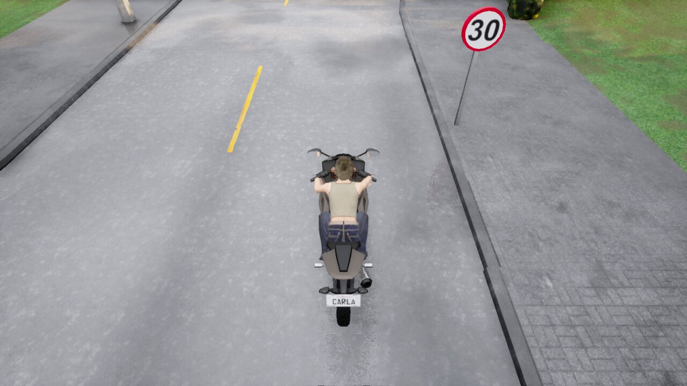
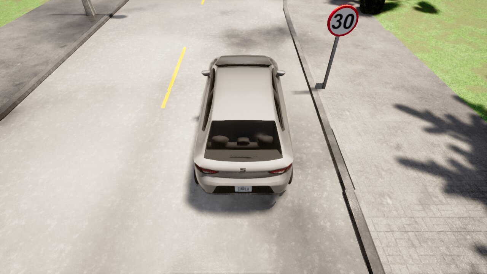
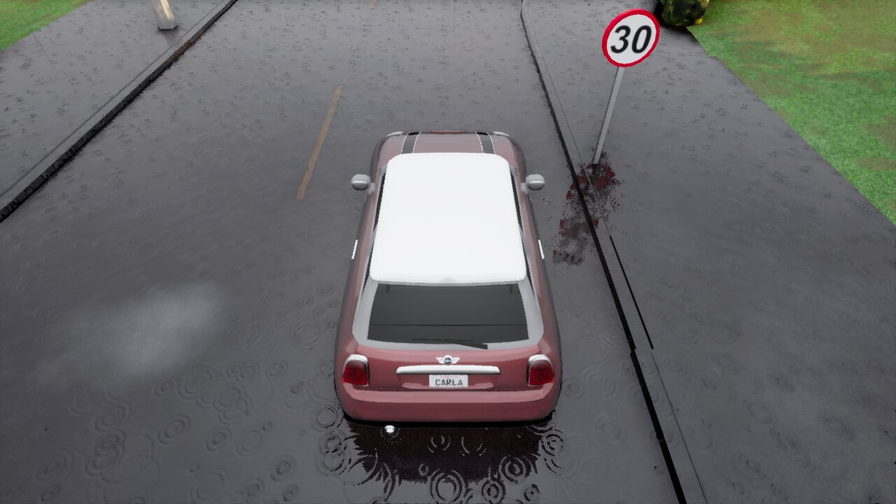

<div align="center">    
 
# A Synthetic Dataset for Vehicle Speed Detection      
[](https://arxiv.org/abs/2104.09903)

</div>

---

## Introduction

---

This is a synthetic dataset built to develop an intelligent speed detection system. This dataset has been generated with the Carla Simulator, and has sequences recorded from a single point of view, with a camera centered on the road at a height of 3 meters, with an inclination of 45 degrees.

"Data-driven vehicle speed detection from synthetic driving simulator images", A. Hernández, et. al., 2021 [[arxiv](https://arxiv.org/abs/2104.09903)]

<p align="center">
  
   
  
</p>

You can download the dataset (images in JPG format and annotations in JSON-like format) from [here](https://universidaddealcala-my.sharepoint.com/:f:/g/personal/antonio_hernandezm_uah_es/Ekc3fwPznEpBlXMMLf4X6LUBSla5SYtRefCCPG9SPCbxzg?e=GaZTUT)

The provided "DataSet Generator.py" code creates a new simulation, and records the images at 80 fps. Due to the image processing and recording, the dataset generation process may take some time to complete. 

The file created by this code can be transformed to json with the file "dict2json.py".

---
## Data processing

The images in this dataset are labeled with the json file that can be found in the download link. An example element can be seen below:
 
 ```
{
  "vehicles": [
    {
      "elapsed_seconds": 2.058767163194716,
      "delta_seconds": 0.012500000186264515,
      "frame": 5207,
      "platform_timestamp": 597544.376398325,
      "x": 392.1999816894531,
      "y": 304.0,
      "velocity": 24.0424747467041,
      "player_id": 259,
      "player_type": "vehicle.carlamotors.carlacola",
      "attributes": {
        "number_of_wheels": "4",
        "sticky_control": "true",
        "object_type": "",
        "color": "255,68,0",
        "role_name": "hero"
      },
      "weather_type": "WeatherParameters(cloudiness=30.000000, cloudiness=30.000000, precipitation=40.000000, precipitation_deposits=40.000000, wind_intensity=30.000000, sun_azimuth_angle=250.000000, sun_altitude_angle=20.000000, fog_density=15.000000, fog_distance=50.000000, fog_falloff=0.900000, wetness=80.000000)"
    },
    {...
   ```
In the vehicles dictionary there is an element like this for each one of the frames from the dataset. Some of the most important values are the frame to which each element corresponds ("frame"), the Id, which allows us to know to which sequence the image belongs ("player_id"), and the vehicle generated for the current sequence ("player_type"). We also have other important attributes to take into account, such as the total simulation time ("elapsed_seconds"), or the time elapsed since the last frame ("delta_seconds").

---
## Requirements

* python                    3.8.5
* numpy                     1.17.4
* pygame                    2.0.0
* Carla                     0.9.10

---

## Citation
Please cite the paper in your publications if it helps your research: 
```
@misc{martinez2021datadriven,
      title={Data-driven vehicle speed detection from synthetic driving simulator images}, 
      author={Antonio Hernández Martínez and Javier Lorenzo Díaz and Iván García Daza and David Fernández Llorca},
      year={2021},
      eprint={2104.09903},
      archivePrefix={arXiv},
      primaryClass={cs.CV}
}
```
